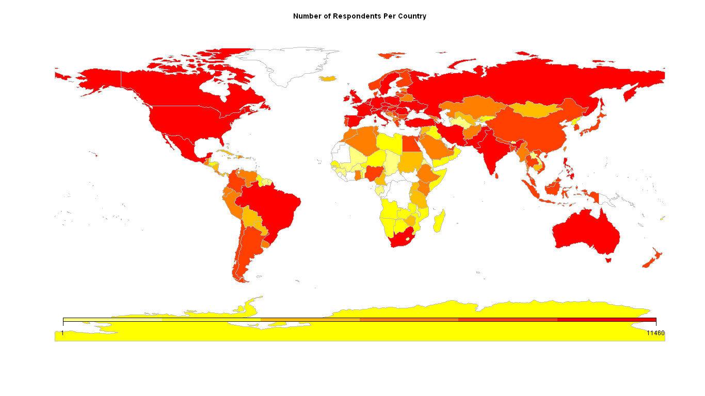

###  <span style = "color:red">by Sam Adekunle & Katarina Domijan</span>

### <span style = "color:red">Department of Mathematics and Statistics, Maynooth University</span>


## <span style = "color:blue">Introduction</span>

Stack Overflow, which is one of the world’s largest communities of software developers, conducts an annual survey within which they get Developers to share information about their jobs, favourite technologies, work preferences etc. In 2017, over 64,000 developers took the survey.

This research project focuses on identifying trends, clusters and relationships in the data and to visualise the  results. Points of interest will be placed on how the experience of Irish-based developers compares with what we see world-wide. Also, different Data Analytical languages will be used so as to compare them.

### <span style = "color:blue">Diversity</span>

The survey consisted of Developers from over 200 countries.


```{r include = FALSE, echo = FALSE, results='hide', fig.keep='all', message=FALSE, warning=FALSE}
library(dplyr)
library(knitr)
library(ggplot2)
library(tidyr)
library(readr)
library(plotly)
library(scales)
library(ggthemes)
library(tidyverse)
library(maps)
library(rworldmap)
library(ggfittext)
library(treemapify)
library(stringr)
library(formatR)
options(scipen = 999)


survey_df <- read.csv(file = "survey_results_public.csv", encoding = "UTF-8")

# sapply(survey_df, class)


# Bar Chart ggplot for Country vs count
Country_Sum_data = as.data.frame(table(survey_df$Country))

Country_Sum <- filter(Country_Sum_data, Freq >870 | Var1 == "Ireland" | Var1 == "Israel")

names(Country_Sum_data)[names(Country_Sum_data) == 'Freq'] <- 'Number of Respondents Per Country'

Countries <- joinCountryData2Map(Country_Sum_data, joinCode = "NAME", nameJoinColumn = "Var1")
par(mar=c(0,0,0.2,0),xaxs="i",yaxs="i")

```

```{r plotmap, echo = FALSE, dpi=300, results='hide',fig.keep='all', message=FALSE, warning=FALSE, fig.width=15, fig.height=10}

png("map.png", width = 1366, height = 768)
mapParams <- mapCountryData( Countries, nameColumnToPlot="Number of Respondents Per Country", addLegend=FALSE,numCats = 6 )
do.call( addMapLegend, c(mapParams, legendWidth=0.5,legendIntervals="page", legendMar = 10))
dev.off()
```




A large majority come from countries such as USA, India, UK etc. For the sake of a lot of the charts in this project some low response but interesting countries were also included. 


```{r echo = FALSE, results='hide',fig.keep='all', message=FALSE, warning=FALSE, fig.width = 15, fig.height = 10}
ggplot(Country_Sum, aes(x = reorder(Var1, -Freq), y = Freq)) +
   geom_bar(stat = "identity",fill = "#42dff4") +
   theme(axis.text.x=element_text(angle=90,hjust=1,vjust=1)) +
  labs(title = "Number of Respondents Per Country") +
  ylab("Number of Respondents")+
  theme(axis.text.y=element_text(size=14), axis.text.x = element_text(size=14), plot.title = element_text(size = 17))+
  xlab("Countries")
```

A significantly large proportion of respondents have been programming for *20 or more years*. This is because Stack Overflow is a Question and Answer website for Developers. Due to this, a lot of users on the website are experienced developers. And they are most likely to spend more time on the website due to them answering questions. This in turn means that they are most likely to see and respond to a survey than people who only ever visit the website when they need to ask a question. 

What can also be seen is that there aren't a lot of women in Developer Industry. This is a problem that has plagued the industry for a while but female proportion is on the rise.


```{r echo = FALSE, results='hide',fig.keep='all', message=FALSE, warning=FALSE, fig.width=15, fig.height=10}
survey_df$YearsProgram <- factor(survey_df$YearsProgram, levels = c("Less than a year", "1 to 2 years", "2 to 3 years", "3 to 4 years", "4 to 5 years", "5 to 6 years", "6 to 7 years", "7 to 8 years", "8 to 9 years", "9 to 10 years", "10 to 11 years", "11 to 12 years", "12 to 13 years", "13 to 14 years", "14 to 15 years", "15 to 16 years", "16 to 17 years", "17 to 18 years", "18 to 19 years", "19 to 20 years", "20 or more years"))

years_programming <- survey_df[ , which(names(survey_df) %in% c("YearsProgram", "Gender")), drop = FALSE]

years_programming <- transform(years_programming, freq = ave(seq(nrow(years_programming)), years_programming, FUN=length))

years_programming <- years_programming[order(years_programming$freq), ]

str(years_programming)

ggplot(mapping =  aes(x = YearsProgram, fill = Gender),data = years_programming %>% filter(Gender == "Male" | Gender == "Female")%>% drop_na(YearsProgram)) +   # Fill column
  geom_bar( width = .6) +   # draw the bars
  labs(title="Years spent programming (Male vs Female)") +
  # Tufte theme from ggfortify
  theme(plot.title = element_text(hjust = .5)) +   # Centre plot title
  scale_fill_brewer(palette = "Dark2") +  # Colour 
  theme(axis.text.x = element_text(angle=90, vjust=0.6)) +
  theme(axis.text.y=element_text(size=14), axis.text.x = element_text(size=14), plot.title = element_text(size = 17))+
  xlab("Years spent programming") +
  ylab("Number of Respondents")
```


### <span style = "color:blue">Salary</span>


We'll first take a look at an important metric, Salary. Taking a look at the different salary ranges in different countries and how it reflects upon other parameters in relation to that country.
For example if we take a look at this chart of Salary vs Developer Type, otherwise known as the average salary for each job. We see that the more niche jobs such as DevOps Specialist and Machine learning specialist are the highest paying jobs albeit representing only 7.7% of the job market. This is most likely due to the fact that there is a high demand for such specialists but a low supply. This in turn causes employers to offer a higher salary so as to entice such people to work for them.

```{r echo = FALSE, results='hide',fig.keep='all', message=FALSE, warning=FALSE}
Job_Salary <- survey_df %>% drop_na(DeveloperType) %>% drop_na(Salary)
jobs <- strsplit(as.character(Job_Salary$DeveloperType), ';')
Job_Salary <- data.frame(DeveloperType = trimws(unlist(jobs)), Salary = rep(Job_Salary$Salary, sapply(jobs, FUN=length)))
jobs2 = as.data.frame(table(data.frame(DeveloperType = trimws(unlist(jobs)))))


salary_job <- Job_Salary %>%
  filter(DeveloperType != "Other") %>%
  group_by(DeveloperType) %>%
  summarise(average_salary = mean(Salary, na.rm = TRUE)) %>%
  arrange(desc(average_salary))


  round_to <- function(x, to = 10) round(x/to)*to


salary_job_plot <- salary_job %>%
  mutate(DeveloperType = reorder(DeveloperType, average_salary)) %>%
  ggplot(aes(DeveloperType, average_salary)) +
  geom_bar(stat = "identity", fill = "#42dff4") +
  ylab("Average salary (USD)") +
  xlab("Developer Type") +
  scale_y_continuous(labels = dollar_format()) +
  geom_text(aes(y = average_salary, label = round_to(average_salary, 100), stat = "identity", hjust = 1)) +
  labs(title = "Salary per Developer Type") +
  theme(axis.text.x=element_blank(), axis.ticks=element_blank())+
  theme(plot.title = element_text(hjust = 1)) +
  theme(axis.text.y=element_text(size=14), plot.title = element_text(size = 17))+
  coord_flip()


count_job_plot <- Job_Salary %>%
  filter(DeveloperType != "Other") %>%
  ggplot(aes(reorder(DeveloperType,DeveloperType,function(x)+length(x)))) +
  geom_bar( fill = "#42dff4") +
  ylab("Number of respondents") +
  xlab("Developer Type") +
  geom_text(aes(y = ((..count..)/sum(..count..)), label = scales::percent((..count..)/sum(..count..))), stat = "count", hjust = -0.4) +
  theme(axis.text.y=element_text(size=14), axis.text.x = element_text(size=14), plot.title = element_text(size = 17))+
  labs(title = "Developer Type by Popularity") +
  theme(plot.title = element_text(hjust =1)) +
  theme(axis.title.y=element_blank())+
  
  coord_flip()


```

```{r echo = FALSE, fig.keep='all', message=FALSE, warning=FALSE, fig.width = 15, fig.height=10}

require(cowplot)
plot_grid(salary_job_plot, count_job_plot)

```

This seems to be a similar story among most other countries assuming each country has a similar proportion of jobs as the graph above. Although there are huge differences in average wages between the lower earning and higher earning countries, the shape of the graphs and average salary per developer type seem to be the same. This shows that no matter what country it is, the jobs based on more niche and specialised technologies such as *"Machine Learning Specialist"* will always be the amongst the highest paying jobs.


```{r echo = FALSE, results='hide',fig.keep='all', message=FALSE, warning=FALSE, fig.width = 15,fig.height=15}
dev_salary_undergrad <- survey_df %>%
  filter(!is.na(DeveloperType)) %>%
  drop_na(Salary) %>%
  filter(Country %in% Country_Sum$Var1) 
country_dev <- strsplit(as.character(dev_salary_undergrad$DeveloperType), ';')
dev_salary_undergrad <- data.frame(DeveloperType = trimws(unlist(country_dev)), Salary = rep(dev_salary_undergrad$Salary , sapply(country_dev, FUN=length)), Country = rep(dev_salary_undergrad$Country, sapply(country_dev, FUN=length)))

freq_dev_undergrad <- as.data.frame(table(dev_salary_undergrad$DeveloperType))

dev_undergrad_salary <- dev_salary_undergrad %>%
  group_by(DeveloperType, Country) %>%
  summarise(average_salary = mean(Salary, na.rm = TRUE)) %>%
  arrange(desc(average_salary))

dev_undergrad_salary %>%
  ggplot(aes(x = reorder(DeveloperType, -average_salary), y = average_salary)) +
  geom_bar(stat = "identity", fill = "#42dff4") +
  ylab("Average salary (USD)") +
  scale_y_continuous(labels = dollar_format()) +
  coord_flip() +
  facet_wrap(~ Country, nrow = 5)  +
  theme_bw()+
  theme(axis.text.y=element_text(size=14), axis.text.x = element_text(size=14), plot.title = element_text(size = 17))+
  theme(strip.text = element_text(size = 12))+
  xlab("Countries") +
  labs(title = "Developer Type vs Salary per Country")

```


### <span style = "color:blue">Career and Job Satisfaction</span>

 An interesting trend was job satisfaction with Salary. As seen in the graph, the people who were the most satisfied were not necessarily the people who made the most money. Which contradicts the common notion that being paid more would make you happier with your job.
 
```{r echo = FALSE, results='hide',fig.keep='all', message=FALSE, warning=FALSE, fig.width = 15, fig.height = 10}
survey_df$JobSatisfaction <- factor(survey_df$JobSatisfaction)
salary_Satisfaction <- survey_df %>% 
  drop_na(JobSatisfaction) %>%
  group_by(JobSatisfaction) %>%
  summarise(average_salary = mean(Salary, na.rm = TRUE))
salary_Satisfaction %>%
  ggplot(aes(JobSatisfaction, average_salary)) +
  geom_bar(stat = "identity", fill = "#42dff4") +
  ylab("Average Salary (USD)") +
  labs(title = "Average Salary vs Job Satisfaction") +
  xlab("Job Satisfaction") +
    theme(axis.text.y=element_text(size=14), axis.text.x = element_text(size=14), plot.title = element_text(size = 17))+
  scale_y_continuous(labels = dollar_format())

```

```{r echo = FALSE, results='hide',fig.keep='all', message=FALSE, warning=FALSE}
career_job_satisfaction <- survey_df %>% 
  filter(!is.na(JobSatisfaction)) %>%
  drop_na(CareerSatisfaction) %>%
  group_by(JobSatisfaction) %>%
  summarise(CareerSatisfaction = mean(CareerSatisfaction, na.rm = TRUE))


career_job_plot <- ggplot(career_job_satisfaction, mapping = aes(x = JobSatisfaction, y = CareerSatisfaction)) + 
  geom_count(aes(color = ..prop.., size = ..prop..)) +
  geom_smooth(method = "lm", se = F) +
  guides(color = 'legend') +
  labs(title = "Job Satisfaction vs Career Satisfaction",
       y = "Career Satisfaction",
       x = "Job Satisfaction") +
  theme(axis.text.y=element_text(size=14), axis.text.x = element_text(size=14), plot.title = element_text(size = 17))


```

But when we look at some individual countries. Lower earning countries such as Poland seem to have a somewhat linear plot with regards to average salary vs job satisfaction where as salary increases job satisfaction also increases. This is somewhat expected as in those countries a higher salary could result in a significantly better quality of life.
Whereas in higher earning countries such as Australia, Germany and United States, the graph seems to be a lot more even, the people who gave their rating a score of 4/5 also seem to have the lowest average salaries.
Although Ireland and Israel are relatively high earning countries, their plot seems to take on a different shape wherein the people who gave their rating a score of 4/5 also seem to have the highest average salaries. 

```{r echo = FALSE, results='hide',fig.keep='all', message=FALSE, warning=FALSE, fig.width=15, fig.height = 15}

salary_satisf_country <- survey_df %>% 
  filter(!is.na(JobSatisfaction)) %>%
  filter(Country %in% Country_Sum$Var1) %>%
  group_by(JobSatisfaction, Country) %>%
  summarise(average_salary = mean(Salary, na.rm = TRUE))

salary_satisf_country %>%
  ggplot(aes(JobSatisfaction, average_salary)) +
  geom_bar( color = "white", fill = "#42dff4", stat = "identity") +
  facet_wrap(~ Country, nrow = 4)  +
  xlab("Job Satisfaction") +
  ylab("Average Salary (USD)") +
  labs(title = "Average Salary vs Job Satisfaction per Country") +
theme(axis.text.y=element_text(size=14), axis.text.x = element_text(size=14), plot.title = element_text(size = 17))+  
  scale_y_continuous(labels = dollar_format())

```


And as you can tell, there is an interesting relationship when it comes to career satisfaction per country relative to Ireland. Ireland seems to be low on the scale, but it must be taken into account that the differences between Ireland and most of the other countries are relatively small *(&plusmn; 0.5)*. With the biggest differences being between India and Israel which also happen to be one of the least and highest earning countries respectively.
    
```{r echo = FALSE, results='hide',fig.keep='all', message=FALSE, warning=FALSE}
names(Country_Sum_data)[names(Country_Sum_data) == 'Number of Respondents Per Country'] <- 'Freq'

Country_Work_Satisfaction <- filter(Country_Sum_data, Freq >400 | Var1 == "Ireland")
Work_Satisfaction <- survey_df %>%
  filter(EmploymentStatus == "Employed full-time") %>%
  filter(Country %in% Country_Work_Satisfaction$Var1) %>%
  group_by(Country) %>%
  summarise(Career_Satisfaction = mean(CareerSatisfaction, na.rm = TRUE)) %>%
  arrange(desc(Career_Satisfaction))


  Work_Satisfaction$Career_Satisfaction <- (sapply(Work_Satisfaction$Career_Satisfaction, function(x, subt) x - subt, subt = Work_Satisfaction$Career_Satisfaction[which("Ireland" == Work_Satisfaction$Country)]))

Work_Satisfaction$Career_Sat_Flag <- ifelse(Work_Satisfaction$Career_Satisfaction < 0, "below", "above")
Work_Satisfaction <- arrange(Work_Satisfaction, Career_Satisfaction) 
Work_Satisfaction$Country <- factor(Work_Satisfaction$Country, levels = Work_Satisfaction$Country)


ggplot(Work_Satisfaction, aes(x=`Country`, y=Career_Satisfaction, label=Career_Satisfaction)) + 
  geom_bar(stat='identity', aes(fill=Career_Sat_Flag))  +
  scale_fill_manual(name="Career Satisfaction", 
                    labels = c("Above Ireland", "Below Ireland"), 
                    values = c("above"="#00ba38", "below"="#f8766d")) + 
  labs(title= "Career Satisfaction relative to Ireland") + 
  ylab("Career Satisfaction difference") +
  theme(axis.text.y=element_text(size=14), axis.text.x = element_text(size=14), plot.title = element_text(size = 17))+
  coord_flip()
```

A parameter that is linked with Career Satisfaction is one in which the respondents stated whether or not they were overpaid. The plots seem to be the same pretty much across the board where most people seem to be *Somewhat underpaid* or *Neither overpaid or underpaid*. But India stands out as a country where a higher proportion than normal claim to be *Greatly underpaid*. This is understandable due to the average salary in the country being amongst the lowest in the world. Whereas Ireland stands out as the only country where a greater proportion of the respondents claim to be *Somewhat overpaid* than those who claim to be *Greatly underpaid*.

```{r echo = FALSE,fig.keep='all', message=FALSE, warning=FALSE, fig.width=15, fig.height=15}


survey_df$Overpaid <- factor(survey_df$Overpaid, levels = c("Greatly overpaid", "Somewhat overpaid", "Greatly underpaid", "Neither underpaid nor overpaid", "Somewhat underpaid"))


overpaid_each_country <- survey_df[ , which(names(survey_df) %in% c("Overpaid","Country")), drop = FALSE]

overpaid_each_country <- transform(overpaid_each_country, freq = ave(seq(nrow(overpaid_each_country)), Overpaid, FUN=length))

overpaid_each_country <- overpaid_each_country[order(overpaid_each_country$freq), ]


  overpaid_each_country <- overpaid_each_country %>%
  filter(!is.na(Overpaid)) %>%
  filter(Country %in% Country_Sum$Var1) 
  
str(overpaid_each_country)

overpaid_each_country$Overpaid <- factor(overpaid_each_country$Overpaid, levels = c("Greatly overpaid", "Somewhat overpaid", "Greatly underpaid", "Neither underpaid nor overpaid", "Somewhat underpaid"))

print(levels(overpaid_each_country$Overpaid))

ggplot(overpaid_each_country, aes(x = Overpaid, y = ..prop.., group = 1)) +
 geom_bar( color = "white", fill = "#42dff4") +
  facet_wrap(~ Country, nrow = 4)  +
  aes(stringr::str_wrap(Overpaid, 10)) +
  ylab("Proportion of Respondents")+
  labs(title = "Are you Overpaid or Underpaid?") +
  theme(axis.title.x=element_blank(), axis.text.y=element_text(size=12), axis.text.x = element_text(size=12), plot.title = element_text(size = 17))
```


## <span style = "color:blue">Education</span>
```{r echo = FALSE, results='hide',fig.keep='all', message=FALSE, warning=FALSE}
 


Undergrad_Salary <- survey_df %>% drop_na(MajorUndergrad) %>% drop_na(Salary)
salary_undergrad <- Undergrad_Salary %>%
  group_by(MajorUndergrad) %>%
  summarise(average_salary = mean(Salary, na.rm = TRUE)) %>%
  arrange(desc(average_salary))


  

salary_undergrad_plot <- salary_undergrad %>%
  mutate(MajorUndergrad = reorder(MajorUndergrad, average_salary)) %>%
  ggplot(aes(MajorUndergrad, average_salary)) +
  geom_bar(stat = "identity", fill = "#42dff4") +
  ylab("Average salary (USD)") +
  xlab("Undergraduate Major") +
  scale_y_continuous(labels = dollar_format()) +
  geom_text(aes(y = average_salary, label = round_to(average_salary, 100), stat = "identity", hjust = 1)) +
  labs(title = "Salary per Undergraduate Major") +
  theme(plot.title = element_text(hjust = 1)) +
  theme(axis.text.x=element_blank(), axis.ticks=element_blank())+
  theme(axis.text.y=element_text(size=14), plot.title = element_text(size = 17))+
  coord_flip()


count_undergrad_plot <- Undergrad_Salary %>%
  ggplot(aes(reorder(MajorUndergrad,MajorUndergrad,function(x)+length(x)))) +
  geom_bar( fill = "#42dff4") +
  ylab("Number of respondents") +
  xlab("Undergraduate Major") +
  geom_text(aes(y = ((..count..)/sum(..count..)), label = scales::percent((..count..)/sum(..count..))), stat = "count", hjust = -0.4) +
  
  labs(title = "Undergraduate Major by Popularity") +
  theme(axis.title.y=element_blank())+
  theme(plot.title = element_text(hjust = 1)) +
  theme(axis.text.y=element_text(size=14), axis.text.x = element_text(size=14), plot.title = element_text(size = 17))+
  
  coord_flip()

```


The same trend can be seen here as with the Salary vs DeveloperType plots, the less popular the Undergraduate Major, the higher the salary. But it's also possible for someone to get a certain Undergraduate degree but change careers into Computer Science.


```{r echo = FALSE, fig.keep='all', message=FALSE, warning=FALSE, fig.width = 15, fig.height=10}

require(cowplot)
plot_grid(salary_undergrad_plot, count_undergrad_plot)

```

The more obscure Undergraduate degrees don't have respondents in some of the countries with large numbers of respondents, especially the low earning countries. And the respondents that they have seem to have relatively high average salaries. These 2 factors combined make those degrees out to be the more lucrative ones when observing the dataset as a whole; but this goes to show that the abundance of jobs in some countries also allows for more niche jobs as well as people from more varied educational backgrounds working in the Computer Science industry.

Whereas the more popular degrees have a high number of respondents in lower earning countries which in turn brings down the average salaries of those degrees by quite a bit. This can be seen by comparing the graphs of countries such as India and United States. 
The most popular route to the Developer Industry still seems to be through a Computer Science discipline which accounts for *75.7%* of the Undergraduate degrees obtained. But it's not the only avenue into the industry as people came from a large variety of degrees.

```{r echo = FALSE, results='hide',fig.keep='all', message=FALSE, warning=FALSE, fig.width = 15,fig.height=15}
country_salary_undergrad <- survey_df %>%
  filter(!is.na(MajorUndergrad)) %>%
  drop_na(Salary) %>%
  filter(Country %in% Country_Sum$Var1) 
country_undergrad <- strsplit(as.character(country_salary_undergrad$MajorUndergrad), ';')
country_salary_undergrad <- data.frame(MajorUndergrad = trimws(unlist(country_undergrad)), Salary = rep(country_salary_undergrad$Salary , sapply(country_undergrad, FUN=length)), Country = rep(country_salary_undergrad$Country, sapply(country_undergrad, FUN=length)))

freq_country_undergrad <- as.data.frame(table(country_salary_undergrad$MajorUndergrad))

country_undergrad_salary <- country_salary_undergrad %>%
  group_by(MajorUndergrad, Country) %>%
  summarise(average_salary = mean(Salary, na.rm = TRUE)) %>%
  arrange(desc(average_salary))

country_undergrad_salary %>%
  ggplot(aes(x = reorder(MajorUndergrad, -average_salary), y = average_salary)) +
  geom_bar(stat = "identity", fill = "#42dff4") +
  ylab("Average salary (USD)") +
  scale_y_continuous(labels = dollar_format()) +
  coord_flip() +
  facet_wrap(~ Country, nrow = 5)  +
  theme_bw()+
  labs(title = "Undergraduate Major vs Salary per Country")+
  theme(axis.text.y=element_text(size=14), axis.text.x = element_text(size=14), plot.title = element_text(size = 17))+
  theme(strip.text = element_text(size = 12))+
  xlab("Countries")

```

As seen in the plot below, there are multiple ways of getting into the Computer Science Industry through avenues other than Undergraduate degrees. Although Bachelor's degrees, which are undergraduate degrees, are the most common as they make up about *57%* of the highest level of formal education completed. And surprisingly no respondent seems to have gotten into the industry on just their secondary school education alone. This comes as a bit of a surprise as there are quite a few completely self-taught developers in the industry.
People of White or European descent have the more diverse range of formal education while also having the highest proportion to obtain postgraduate degrees.

```{r echo = FALSE, fig.keep='all', message=FALSE, warning=FALSE, fig.width=15, fig.height=10}

survey_df$FormalEducation <- factor(survey_df$FormalEducation, levels = c("Primary/elementary school", "Bachelor's degree", "Master's degree", "Some college/university study without earning a bachelor's degree", "Professional degree",  "Doctoral degree", "Secondary school","I never completed any formal education", "I prefer not to answer"))

Undergrad_Race <- survey_df %>% 
  drop_na(MajorUndergrad) %>% 
  drop_na(Race) %>% 
  filter(Race != "I prefer not to say") %>%
  filter(str_detect(Race,"I don’t know") == FALSE)
  

  freq_race <- as.data.frame(table(Undergrad_Race$Race)) %>% filter(Freq < 150)
  for(i in 1:length(freq_race$Var1)){
      l = as.character(freq_race$Var1[i]) 
      Undergrad_Race <- Undergrad_Race %>%
        filter(Race != l)
    }

Race_Split <- strsplit(as.character(Undergrad_Race$Race), ';')
Undergrad_Race <- data.frame(Race = trimws(unlist(Race_Split)), FormalEducation = rep(Undergrad_Race$FormalEducation, sapply(Race_Split, FUN=length)))

print(levels(Undergrad_Race$FormalEducation))


ggplot(Undergrad_Race %>%
      drop_na(FormalEducation) %>% 
      filter(FormalEducation != "I prefer not to answer"), aes(x=FormalEducation, y=..prop.., group=Race,fill=Race)) +
  geom_bar(colour="black", position="dodge")+
  geom_text(aes(label=scales::percent(round(..prop..,2)), y=..prop..), stat="count", vjust=-.5, position=position_dodge(.9)) +
  scale_y_continuous(limits=c(0,1),labels = scales::percent) +
  theme_bw()+
  theme(legend.key = element_rect(colour = "black")) +
  guides(fill = guide_legend(override.aes = list(colour = NULL))) +
  aes(stringr::str_wrap(FormalEducation, 15)) +
  labs(title = "Formal Education Completed by Race") +
  ylab("Number of Respondents") +
  theme(axis.text.y=element_text(size=14), axis.text.x = element_text(size=14), plot.title = element_text(size = 17))+
  xlab("Highest level of formal education completed")
```

But there are still a lot of non-formal ways of educating oneself. Especially about upcoming technologies in the industry. The most popular of the non-formal ways is *self-taught* education. This is understandable as Computer Science is a constantly changing and evolving field. So it can be important for Developers to keep up with the changes. This involves a lot of non-formal education, with self-taught education being the most easily accessible.
Also Men and Women educate themselves in the same way for the most part. With women seeming to have slightly less of an affinity for *Open Source contributions*. While men have slightly less of an affinity for *Online courses* and *On-the-job training*.

```{r echo = FALSE,fig.keep='all', message=FALSE, warning=FALSE, fig.width=15, fig.height=10}

EducationType_Gender <- survey_df %>% drop_na(EducationTypes) %>% drop_na(Gender) %>% filter(Gender == "Male" | Gender == "Female")
EducGender <- strsplit(as.character(EducationType_Gender$EducationTypes), ';')
Educate_Gender <- data.frame(EducationTypes = trimws(unlist(EducGender)), Gender = rep(EducationType_Gender$Gender, sapply(EducGender, FUN=length))) 

ggplot(Educate_Gender, aes(x = EducationTypes, group=interaction(Gender)))+ 
  geom_bar(aes(y = ..prop..), stat = "count", position=position_dodge(), fill = "#42dff4") + 
  geom_text(aes(label=scales::percent(round(..prop..,2)), y=..prop..), stat="count", vjust=-.5, position=position_dodge(.9)) +
  scale_y_continuous(limits=c(0,1),labels = scales::percent) +
  theme(axis.text.x = element_text(angle=65, vjust=1, hjust = 1))+
  # aes(stringr::str_wrap(MajorUndergrad, 15)) +
  xlab("Types of non-formal education done") +
  ylab("Proportion of People") +
  labs(title = "Non-Formal Education (Male vs Female)") +
  facet_grid(~Gender) +
  theme(axis.text.x = element_text(size=14), plot.title = element_text(size = 17))+
  theme(axis.text.y=element_blank(), axis.ticks=element_blank())
```


## <span style = "color:blue">Programming Languages</span>


```{r echo = FALSE, fig.keep='all', message=FALSE, warning=FALSE, fig.width=15, fig.height=15}

Lang_Salary <- survey_df %>% drop_na(HaveWorkedLanguage) %>% drop_na(Salary)
Lang <- strsplit(as.character(Lang_Salary$HaveWorkedLanguage), ';')
Lang_Salary <- data.frame(HaveWorkedLanguage = trimws(unlist(Lang)), Salary = rep(Lang_Salary$Salary, sapply(Lang, FUN=length)))
Lang2 = as.data.frame(table(data.frame(HaveWorkedLanguage = trimws(unlist(Lang)))))


Language_Current_Plot <- ggplot(Lang_Salary, aes(x = reorder(HaveWorkedLanguage,HaveWorkedLanguage,function(x)+length(x)))) +
  geom_bar(aes(y = (..count..)/sum(..count..)), fill = "#42dff4") +
  geom_text(aes(y = ((..count..)/sum(..count..)), label = scales::percent((..count..)/sum(..count..))), stat = "count", vjust = 0.4) +
  scale_y_continuous(labels = percent) +
  labs(title = "Programming Language respondents currently working with") +
  theme(axis.text.x=element_blank(), axis.ticks=element_blank(), axis.title.x=element_blank())+
  theme(axis.text.y=element_text(size=14))+
  xlab("Programming Language") +
  coord_flip()

```

```{r echo = FALSE, fig.keep='all', message=FALSE, warning=FALSE, fig.width=15, fig.height=15}

Want_Lang_Salary <- survey_df %>% drop_na(WantWorkLanguage) %>% drop_na(Salary)
Want_Lang <- strsplit(as.character(Want_Lang_Salary$WantWorkLanguage), ';')
Want_Lang_Salary <- data.frame(WantWorkLanguage = trimws(unlist(Want_Lang)), Salary = rep(Want_Lang_Salary$Salary, sapply(Want_Lang, FUN=length)))
Want_Lang2 = as.data.frame(table(data.frame(WantWorkLanguage = trimws(unlist(Want_Lang)))))

Language_Want_Plot <- ggplot(Want_Lang_Salary, aes(x = reorder(WantWorkLanguage,WantWorkLanguage,function(x)+length(x)))) +
  geom_bar(aes(y = (..count..)/sum(..count..)), fill = "#42dff4") +
  geom_text(aes(y = ((..count..)/sum(..count..)), label = scales::percent((..count..)/sum(..count..))), stat = "count", vjust = 0.4) +
  scale_y_continuous(labels = percent) +
  labs(title = "Programming Language respondents want to work with") +
  theme(axis.text.x=element_blank(), axis.ticks=element_blank(), axis.title.x=element_blank(), axis.title.y=element_blank())+
  theme(axis.text.y=element_text(size=14))+
  coord_flip()
```

It's interesting to see that although some languages have widespread use, such as *PHP*, they aren't necessarily the language that most want to work with. And although some aren't utilised by a lot of people, such as *Go*, a lot more people want to work with it.


```{r echo = FALSE, fig.keep='all', message=FALSE, warning=FALSE, fig.width = 15, fig.height=15}

require(cowplot)
plot_grid(Language_Current_Plot, Language_Want_Plot)

```

As is a common trend, the less popular languages have amongst the highest average salaries and the more popular languages have amongst the lowest average salaries. 

```{r echo = FALSE, fig.keep='all', message=FALSE, warning=FALSE, fig.width=15, fig.height=15}

salary_lang <- Lang_Salary %>%
  filter(HaveWorkedLanguage != "Other") %>%
  group_by(HaveWorkedLanguage) %>%
  summarise(average_salary = mean(Salary, na.rm = TRUE)) %>%
  arrange(desc(average_salary))

salary_lang %>%
  mutate(HaveWorkedLanguage = reorder(HaveWorkedLanguage, average_salary)) %>%
  ggplot(aes(HaveWorkedLanguage, average_salary)) +
  geom_bar(stat = "identity", fill = "#42dff4") +
  ylab("Average salary (USD)") +
  scale_y_continuous(labels = dollar_format()) +
  geom_text(aes(y = average_salary, label = round_to(average_salary, 100), stat = "identity", hjust = 1)) +
  xlab("Programming Languages") +
  labs(title = "Programming Languages vs Salary") +
  theme(axis.text.y=element_text(size=14), axis.text.x = element_text(size=14), plot.title = element_text(size = 17))+
  coord_flip()

```

When we look at some of the top languages and their average wage per some of the countries. We see the same trend as always. A surprising observation is that countries such as Israel and Ireland have a relatively high average salary, higher than the likes of United Kingdom and Germany most of the time.

```{r echo = FALSE, fig.keep='all', message=FALSE, warning=FALSE, fig.width=15, fig.height=15}

country_salary_lang <- survey_df %>%
  filter(!is.na(HaveWorkedLanguage)) %>%
  drop_na(Salary) %>%
  filter(Country %in% Country_Sum$Var1) 
country_lang <- strsplit(as.character(country_salary_lang$HaveWorkedLanguage), ';')
country_salary_lang <- data.frame(HaveWorkedLanguage = trimws(unlist(country_lang)), Salary = rep(country_salary_lang$Salary , sapply(country_lang, FUN=length)), Country = rep(country_salary_lang$Country, sapply(country_lang, FUN=length)))

freq_country_lang <- as.data.frame(table(country_salary_lang$HaveWorkedLanguage))

freq_country_lang <- filter(freq_country_lang, Freq <1000)

for(i in 1:length(freq_country_lang$Var1)){
  t = as.character(freq_country_lang$Var1[i]) 
  country_salary_lang <- country_salary_lang %>%
    filter(HaveWorkedLanguage != t)
}

country_lang_salary <- country_salary_lang %>%
  filter(HaveWorkedLanguage != "Other") %>%
  group_by(HaveWorkedLanguage, Country) %>%
  summarise(average_salary = mean(Salary, na.rm = TRUE)) %>%
  arrange(desc(average_salary))

country_lang_salary %>%
  ggplot(aes(x = reorder(Country, -average_salary), y = average_salary)) +
  geom_bar(stat = "identity", fill = "#42dff4") +
  ylab("Average salary (USD)") +
  scale_y_continuous(labels = dollar_format()) +
  theme(axis.text.y=element_text(size=14), axis.text.x = element_text(size=14), plot.title = element_text(size = 17))+
  coord_flip() +
  facet_wrap(~ HaveWorkedLanguage, nrow = 4)  +
  labs(title = "Countries vs Salary per Programming Language")+
  theme(strip.text = element_text(size = 12))+
  xlab("Countries")

```

As we see in this plot the most common languages seem to be very versatile as they are used in all the most common jobs.

```{r echo = FALSE, fig.keep='all', message=FALSE, warning=FALSE, fig.width=15, fig.height=15}

Lang_DeveloperType <- survey_df %>% drop_na(HaveWorkedLanguage) %>% drop_na(DeveloperType)
LangCount <- strsplit(as.character(Lang_DeveloperType$HaveWorkedLanguage), ';')
Lang_DeveloperType <- data.frame(HaveWorkedLanguage = trimws(unlist(LangCount)), DeveloperType = rep(Lang_DeveloperType$DeveloperType, sapply(LangCount, FUN=length)))

LangDevCount <- strsplit(as.character(Lang_DeveloperType$DeveloperType), ';')
Lang_DeveloperType <- data.frame(DeveloperType = trimws(unlist(LangDevCount)), HaveWorkedLanguage = rep(Lang_DeveloperType$HaveWorkedLanguage, sapply(LangDevCount, FUN=length)))
Lang_Merge_Count = as.data.frame(table(Lang_DeveloperType$HaveWorkedLanguage))
DeveloperType_Lang <- as.data.frame((with(Lang_DeveloperType, table(HaveWorkedLanguage, DeveloperType))))
names(Lang_Merge_Count)[names(Lang_Merge_Count) == 'Var1'] <- 'HaveWorkedLanguage'
names(Lang_Merge_Count)[names(Lang_Merge_Count) == 'Freq'] <- 'Count'
Lang_DeveloperType_Count <- merge(DeveloperType_Lang, Lang_Merge_Count,  sort = FALSE)


Lang_Merge_Count <- filter(Lang_Merge_Count, Count <10000)

for(i in 1:length(Lang_Merge_Count$HaveWorkedLanguage)){
  t = as.character(Lang_Merge_Count$HaveWorkedLanguage[i]) 
  Lang_DeveloperType_Count <- Lang_DeveloperType_Count %>%
    filter(HaveWorkedLanguage != t)
}

names(Lang_DeveloperType_Count)[names(Lang_DeveloperType_Count) == 'HaveWorkedLanguage'] <- 'Languages'

ggplot(Lang_DeveloperType_Count, aes(area = Freq, fill = Languages, label = DeveloperType, subgroup = Languages)) +
  geom_treemap() +
  geom_treemap_subgroup_border() +
  geom_treemap_subgroup_text(place = "centre", grow = T, alpha = 0.5, colour =
                               "black", fontface = "italic", min.size = 0) +
  geom_treemap_text(colour = "white", place = "topleft", reflow = T) +
  labs(title = "Developer Type per Programming Language ")
names(Lang_DeveloperType_Count)[names(Lang_DeveloperType_Count) == 'Languages'] <- 'HaveWorkedLanguage'
```

## <span style = "color:blue">Python vs R</span>

For the purpose of Data Analysis, *__R__* and *__Python__* are the most common languages used. The main difference being, R is geared more toward Statistical Analysis while Python is a very broad and general language. But both have large communities which result in vast sources of information online for both languages. As well as a large number of packages that can be used for a lot of specific tasks.

Although most of my work is done in R, I did work in both languages so as to get a good understanding of Data Analysis with both. But prior to this project I had more experience with Python than I did with R. So a lot of my focus was placed on understanding the fundamentals of R.

For the purposes of analysis with R, I am working in *RStudio* and mainly using *dplyr* for data wrangling and *ggplot2* for visualisation. And in the case of Python, I am working in *Spyder* and using *pandas* for data wrangling and *matplotlib* for visualisation.


```{r echo = FALSE, fig.keep='all', message=FALSE, warning=FALSE}
library(reticulate)
use_python("/Users/samad/AppData/Local/Programs/Python/Python37", required = TRUE)

```


#### <span style = "color:green">Python</span>

This is an example of some basic wrangling and visualisation using Python. 
Packages are imported and then prefixed. Reading in data is pretty easy with only a few changes made so the data would be easier to work with once read in. 

The simple plot below was made with matplotlib and was straightorward.

Data wrangling is one of the areas where the differences in both languages is more prominent. Python works by concatenating the column or function name with the object name, seperated by a dot. But calling columns in Python can also be done using [ ] to subset the certain columns only. So getting the number of rows in a column in a dataframe is usually 
*df.column.shape* or *df['column'].shape*


##### __Python__
```{python echo = TRUE, fig.keep='all', warning=FALSE, tidy = TRUE}
#Python
import pandas as pd
import matplotlib.pyplot as plt

df = pd.read_csv(r"survey_results_public.csv", na_values = ['na','NA'], encoding = "utf8" )


fig, ax = plt.subplots()
df.Currency.value_counts().plot(ax=ax, kind = 'bar')
plt.tight_layout()
plt.show()


df_new = df[df['ImportantBenefits'].notnull()]

df2 = pd.melt(pd.concat([df_new['Country'],
                         df_new.loc[:, "ImportantBenefits"].apply(
                                 lambda s: s.strip().split(';')).apply(pd.Series)], axis = 1),
    id_vars='Country')[['Country','value']]
df2 = df2[df2['value'].notnull()]
df2['value'] = df2['value'].map(lambda x: x.strip())
print(df2.head())
```


    
#### <span style = "color:green">R</span>

This is the same example in R. Libraries are imported without the need for prefixing and functions from within Libraries can be called from the code. But this means that functions with the same name can be overridden by other Libraries. But it's also possible to refer to a specific function within a Library.

Reading in data was also straightforward.

The plot however took a bit more work than the one in Python. Whereas matplotlib sorts your plot for you by ordering it properly, also putting the xlabels in vertical format and adding some colour. GGplot on the other hand, gave me the basic barplot and I had to manually order it as well as changing the labels around and adding colour. 

GGplot is good in that it allows you to change every aspect of the plot. But it's not the best for plotting something quickly as it gives you a pretty barebones plot.

R also uses nested functions, where each function is called with *FunctionName()* and columns are specified with *df\$column*. So getting the number of rows in R would be *length(df\$column)*

The dplyr library uses the magrittr principle of chaining functions with the pipe symbol *%>%*. The functionality of it surpasses anything included with base R. It comes in very handy when trying to run a lot of functions on a dataframe. It can be cumbersome to write for very short functions. This function sets apart R from Python for Data Analysis.

##### __R__
```{r echo = TRUE, fig.keep='all', warning=FALSE, fig.width=15, fig.height=15, tidy=TRUE}
library(dplyr)
library(ggplot2)

df <- read.csv(file = "survey_results_public.csv", encoding = "UTF-8")
ggplot(df%>%drop_na(Currency), aes(reorder(Currency,Currency,function(x)-length(x)))) +
  geom_bar(fill = "#42dff4") +
  theme(axis.text.x = element_text(angle = 90, hjust = 1), axis.title.x = element_blank())


df2 <- df %>% drop_na(ImportantBenefits)
df_new <- strsplit(as.character(df2$ImportantBenefits), ';')
df2 <- data.frame(Country = rep(df2$Country, sapply(df_new, FUN=length)), value = trimws(unlist(df_new)))
head(df2)

```
As you can see, wrangling the data with Python and R yielded the same results. Just printed in a slightly different way. The good thing about both R and Python is that they are interchangeable. R can be used in Python and Python can be used in R.

In the code below I call a dataframe from Python, *py\$df2* and using R. I'm able to create a plot based on the data from Python.

##### __R__
```{r echo = TRUE, fig.keep='all', message=FALSE, warning=FALSE, fig.width=15, fig.height=15, tidy=TRUE}

important_benefits <- py$df2 %>%
  filter(Country %in% Country_Sum$Var1) 

ggplot(important_benefits, aes(x =reorder(value,value,function(x)-length(x)), y = ..prop.., group = 1)) +
  geom_bar(fill = "#42dff4") +
  ylab("Proportion of respondents") +
  coord_flip() +
  facet_wrap(~ Country, nrow = 3)  +
  theme(strip.text = element_text(size = 14))+
  theme(axis.text.y=element_text(size=14), axis.text.x = element_text(size=14), plot.title = element_text(size = 17))+
  xlab("Countries") +
  labs(title = "Most important work benefits")

```
  
The plot above is an interesting one as it shows what people in different countries consider as necessities with regards to their job. In most wealthy countries, *Vacation/days off* seem to be the most important benefits. Countries with good public healthcare systems have proportionally smaller demand placed on *Health Benefits*. Whereas in Ireland, albeit having a public healthcare system. Health Benefits has the second highest demand placed on it. 

Although in the lower earning countries, *Remote Options* is unanimously placed at highest importance. With *Health Benefits* and *Annual Bonus* being the next 2 closest benefits.


## <span style = "color:blue">Conclusion</span>
As seen throughout, a lot of intriguing conclusions were drawn from the data. There are quite a few outlying results that need more information about to say why they differ from others. But for now, reasonable assumptions have been made.

In the case of Python vs R, both were used extensively throughout the process of analysing this data. Although Python is an amazingly versatile language, that is easy to understand and use. I still chose to use R as the basic language for most of the project.

Python has cleaner and tidier syntax but since I already knew Python and was learning R, I found that it was easy to translate Python code into R with the length and simplicity of each language being comparable. In terms of usability and functionality, both have their advantages. But the ability to implement piping using magrittr in R, proved to be more useful than the dot-separated syntax in Python. And for visualisation, I found that ggplot2's customisability and outcome(although cumbersome at times) was superior to that of matplotlib. 
I can envision myself using R in future data analytical projects, especially using it with Python. But in terms of most other types of projects, I'd stick to Python as I think it's better suited. 